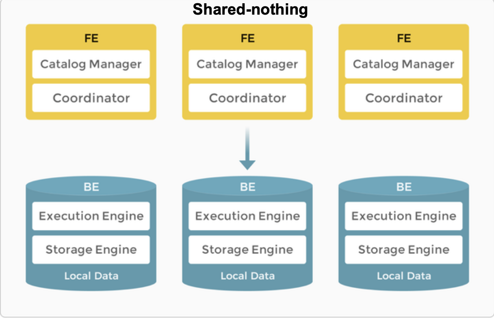

#  StarRocks-Cluster: shared_nothing arch

## Explanations
This setup of starrocks is dependent on starrocks and starrocks only.\
We do not get any benefits of using **MinIO** in our cluster set up here.

>[NOTE!]\
> in this setup starrocks stores its own.

we may use this setup for our own development and testing environment for its easy installation
and simpler structure.

## Cluster nodes info:
- 1 fe-leader node **essential**
- 1 or more be nodes **essential**
- 0 or more fe-helper (fe-follower) nodes **not-essential**
- 0 or more cn nodes (compute nodes) **not-essential**

